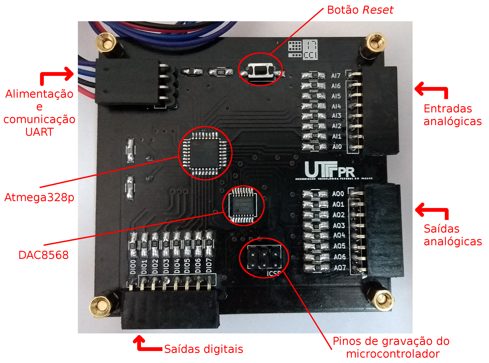
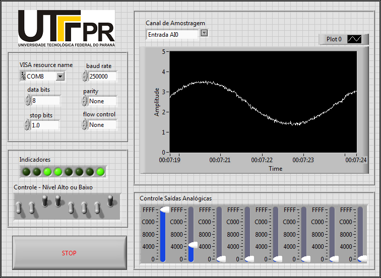

# DAC and ADC controlling plataform

### 2017

Towards the end of my undergrad studies I did a scientific initiation. As a product of my work, I designed an electronic device to send and receive analog and digital signals. The circuit consisted of an Atmega328 microcontroller and an IC DAC, whose communication was established via the SPI interface. The circuit was designed using EDA Kicad software and manufactured industrially. The image below shows the final result.

For the control of the device, I developed an HMI in LabVIEW language, whose function was to send and receive commands via the UART interface. The image below shows the control interface.

