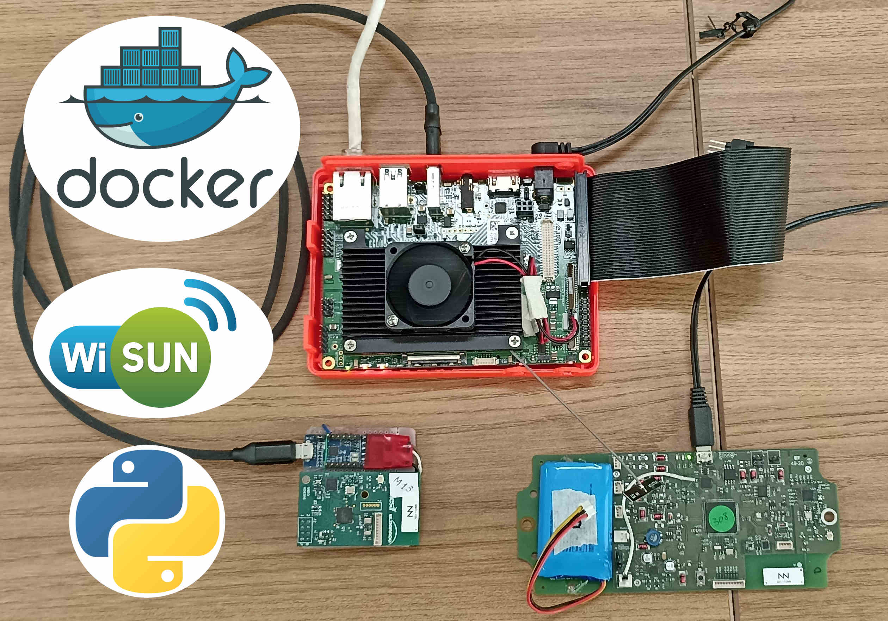

# Python containers in low profile hardware

### 2022

Docker containers always come in handy, when they're properly configured. In this project, a custom Linux image distributed by Toradex was used for a Wi-SUN IoT network gateway hardware. The best part about setting up this system is the possibility to run the application on docker containers, making the job enormously easier.

Three python applications were configured through docker-compose: (1) A RESTFull API with Flask and SQLAlchemy library for local database access; (2) a radio network controller, responsible for reception and transmission of data via ttyUSB0 serial interface; and finally, (3) scheduler, requesting and posting data to the server.

The image below shows the gateway hardware on the top, the radio module on the bottom left and the IoT sensor device on the bottom right.

