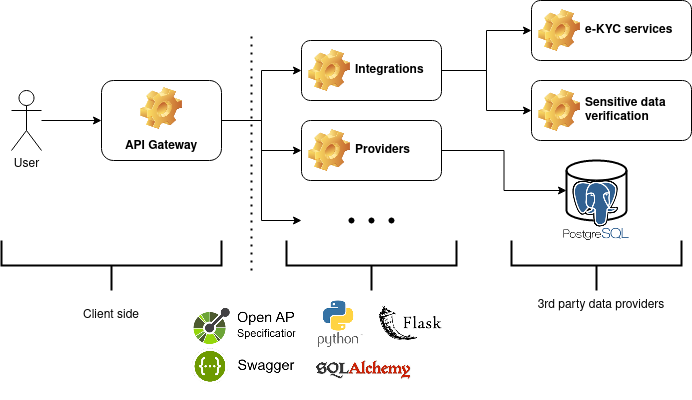

# Electronic Know Your Customer services integration

### 2022

 For the whole year of 2022, I worked as a Python backend developer integrating the client API gateway with 3rd party services. The integrated services were related to:

- Verification of identity of customers;
- Validation of sensible information and documents;
- Querying strategic business informations;
- Building dynamic risk profiling;

The API gateway had an OpenAPI specification and a REST API to format the responses. Generally, I used a Swagger UI for the types visualization. The integrations were written in Python, with the help of libraries like Flask and SQLAlchemy. For one specific service, it was necessary to build a data provider, integrating data from a Postgres database with over than 100 Million records.

