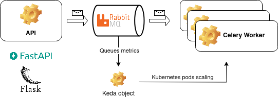

# Asyncronous IoT data processing though Event-Driven Architecture

### 2023

I have been working on maintaining IoT data microservices deployed in Kubernetes clusters since the beginning of the year. The data comes from devices that sample the energy consumption from users' houses, and process it using Machine Learning algorithms. The end product is a mobile application that shows the user the appliance's energy consumption/cost and some metrics. 

Mainly through the Event-Driven architecture, the microservices written in Python are responsible for processing the data, saving them in databases like Postgres and Cassandra, and exposing it to APIs, generally with the help of FastAPI or Flask libraries. The APIs also produce messages, which are sent to RabbitMQ queues and consumed by Celery workers. This is the core idea of the data processing architecture of the project. To make it scalable, there are Keda objects, configured with scaling strategies based on the queue size. To monitor and handle all these microservices logs, we use Graylog, Prometheus and Grafana. 