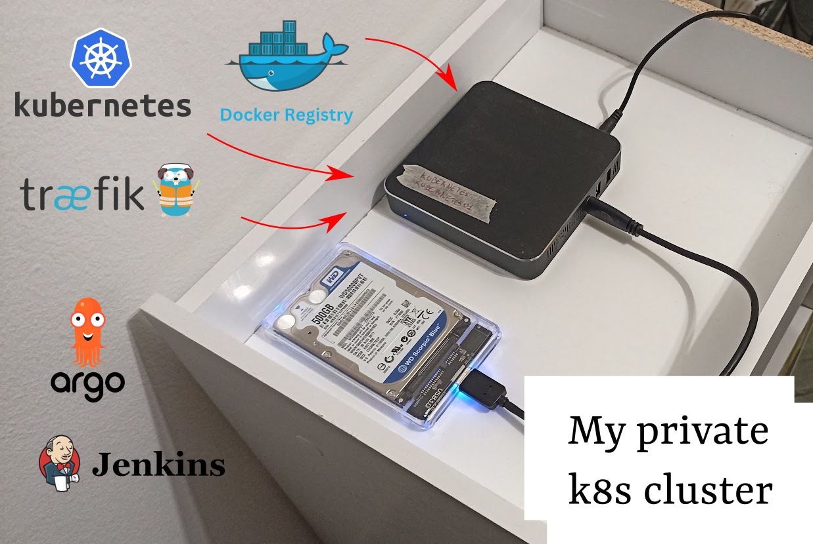

# Building my own Kubernetes cluster

### 2023

Recently I bought a mini computer from Aliexpress and built a K8s cluster with it. I installed microk8s and the initial plan was to set up a CI/CD pipeline with Jenkins, ArgoCD and Docker Registry, to deploy my personal projects. After a few weeks of exploring the services, I discovered that low-end hardware like this (2 CPUs and 6 GB of RAM) is not enough, so I decided to uninstall Jenkins and ArgoCD.

The cluster is now up and running with Traefik and Docker Registry, which I can use to route and deploy my projects. Unfortunately, my internet carrier provider blocks port 80, so my project's URLs are working only on port 8000, which may look hacky for an unaware user.
