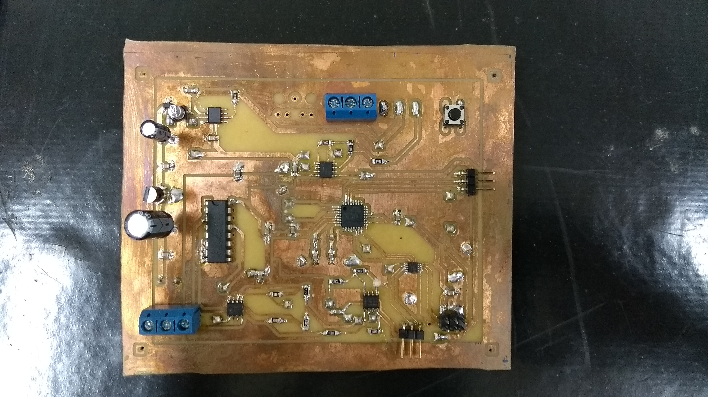
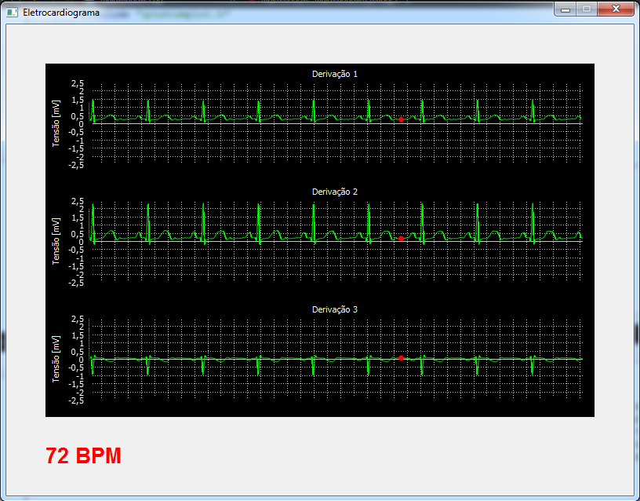

# 3 channel ECG circuit and computer interface

### 2017

My final undergraduate work in electronic engineering was the development of an electrocardiograph circuit capable of capturing 3 ECG leads.

In this work, I designed the entire analog and digital circuit for conditioning and digitizing the signals. I also had to develop the firmware for the Atmega328 microcontroller, which communicated via the UART interface with a computer. In turn, the graphical interface, that I programmed in C++ using the Qt library, received the data and showed it on the computer monitor.

The images below show the manually prototyped circuit and the graphical interface showing the signals.

