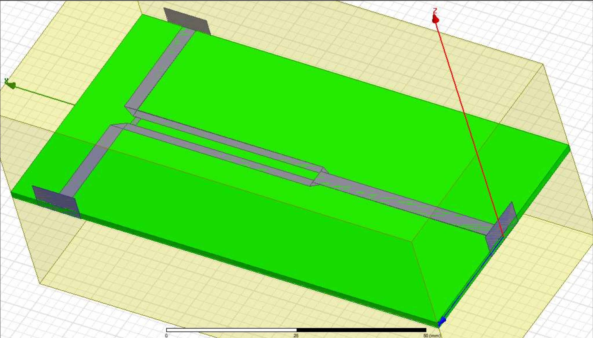

# RF power splitter simulation on HFSS

### 2018

During one of my post-graduation semesters, one of my subjects was "guidance and radiation of RF waves". In this period I was able to better understand the phenomena of RF signals. I got in touch with computational tools for high frequency simulation, like CST and HFSS, and designed some devices, like passive filters, waveguides and a Wilkinson power splitter. The image below shows a power splitter that was simulated using the HFSS.

