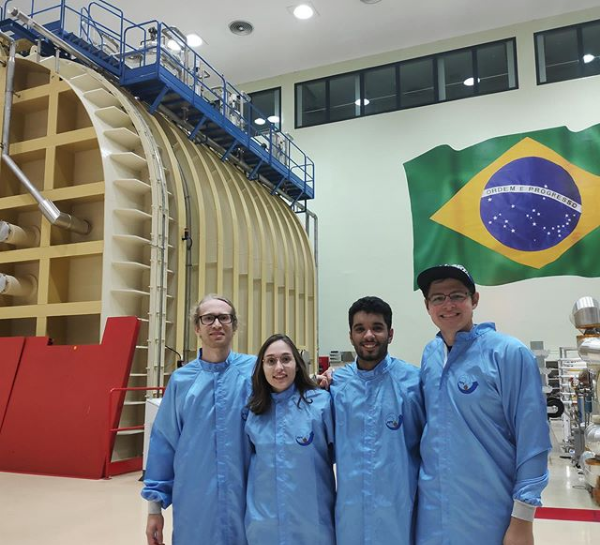
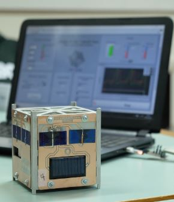
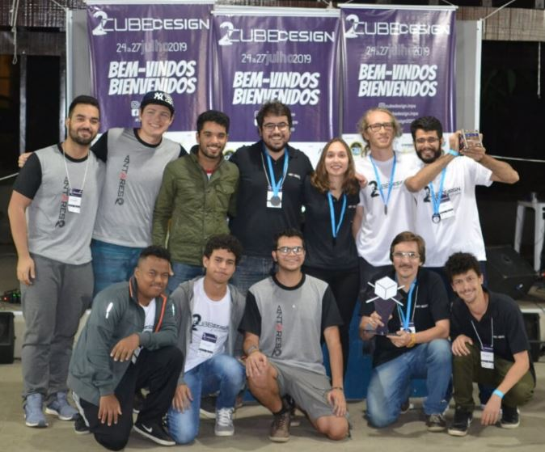

# Winner of the 2nd CubeDesign! Cubsat project

### 2019

I had the opportunity to visit one of the most renowned research centers in Brazil, the National Institute for Space Research (INPE). In the photo below, here we are at the main lab with the largest vacuum chamber in Latin America!

I came to visit the laboratory with my space-modeling team that I was a part of at Unicamp. Our team signed up for the Cubesats (mini satellites) development competition at INPE. In this project, I was responsible for the development of Cubesats orientation algorithm, using solar panels. We used STM32F103 microcontrollers to process the data on the device, which I had to develop part of the logic and firmware. The image below shows the ready Cubsat.

Our Cubesat was subjected to a series of tests, including sensor telemetry, control of a reaction wheel and antenna ejection. Our team demonstrated the best results and we got the first place. Below shows a very proud team receiving our awards.

