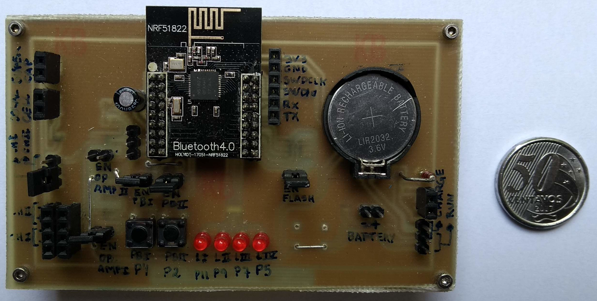
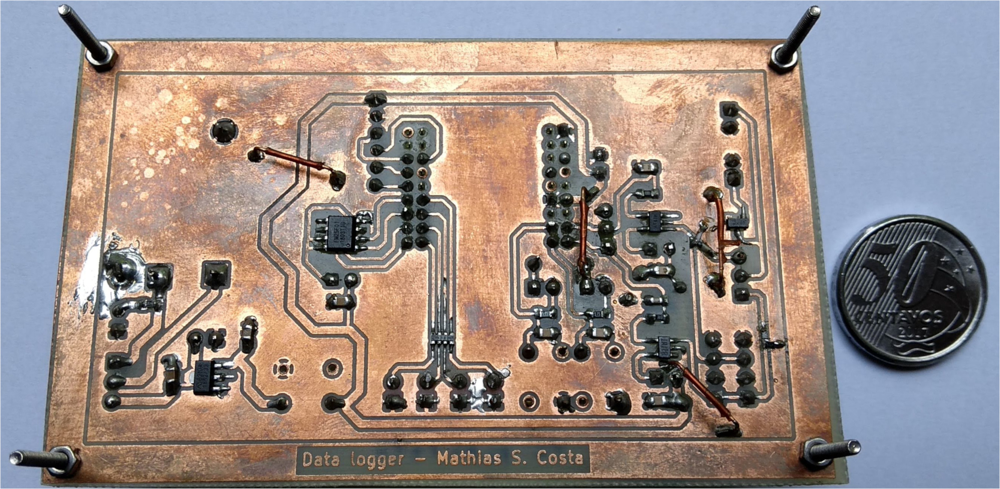

# Low-power datalogger

### 2019

It was necessary to develop a low-consumption datalogger circuit to perform some measurements on my IoT telemetry device in an external environment, developed during my masters degree.

The same microcontroller as the telemetry device, NRF51822, was used to sample voltage levels and store them in flash memory using the SPI interface. For this purpose, an analog conditioning circuit was developed, with operational amplifiers, to limit the bandwidth of the sampled voltage signal.

The images below show the top and bottom sides of the developed circuit.

