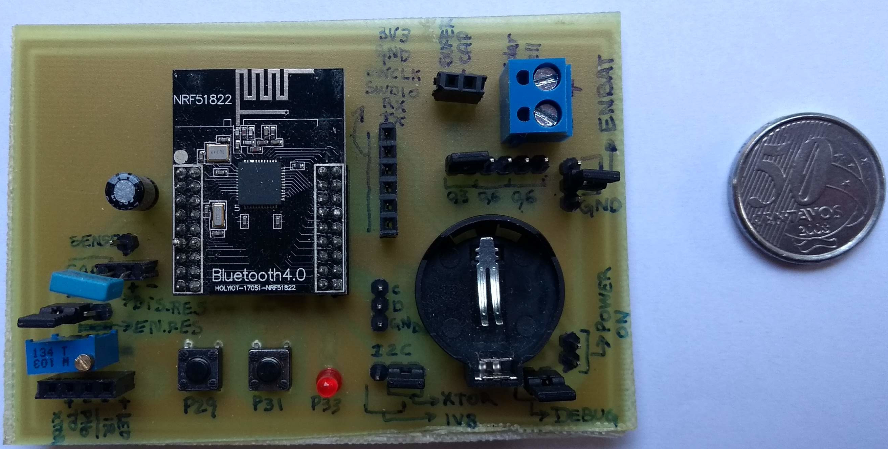
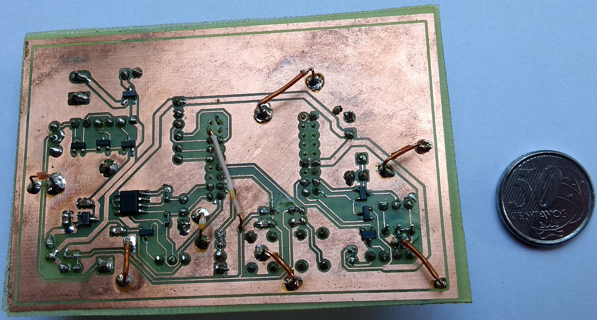

# Water meter IoT device

### 2019

The circuit that I will show below is one of the products of my master's dissertation. In it, I am using a microcontroller NRF51822 for the sensing of a hydrometer and communication of telemetry data via Bluetooth Low-Energy (BLE).

The circuit had to sample voltage signals acquired through an optical sensor, using a low-power comparator. The telemetry data was saved in an EEPROM memory, via the I2C interface, and also sent via BLE.

The biggest challenge of the project was to develop this entire circuit using the harvest of solar energy as an energy source. An energy management circuit had to be developed, which was able to capture energy and store it in a supercapacitor, as well as firmware programming routines and practices were adapted to lower energy consumption.

The images below show the front and bottom circuit layers of the IoT device that was built.

