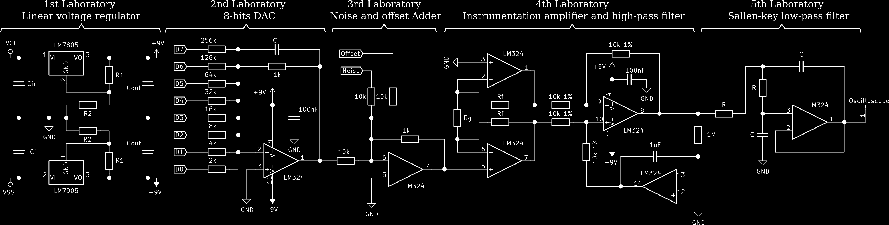
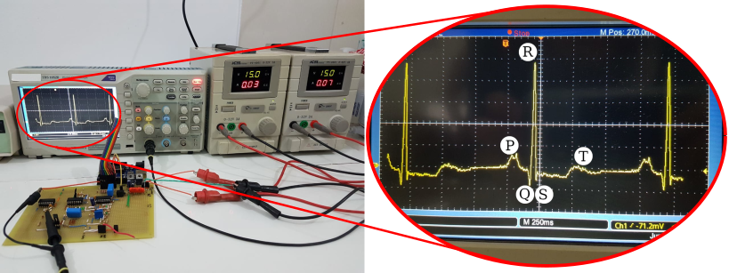

# My first experience as a teacher

### 2020

Just before all the chaos that the COVID-19 pandemic brought to the world, in January 2020 I had the opportunity and the privilege to lead a summer course of basic electronics lab II class. The experience was complete: I had to elaborate the activity scripts, teach the theoretical classes and monitor the student's practical development. The circuit in question that the students had to develop was an ECG signal generator, as well as a circuit for its processing. The complete circuit is shown in the image below.

The students had to weld components of the warehouse in a punctured phenolite plate, composing the following circuits with operational amplifiers:

- DAC 8 bits;
- Inverter adder;
- Instrumentation amplifier;
- Sallen-key filter;

The image below shows one of the working circuits and the result seen on the oscilloscope

