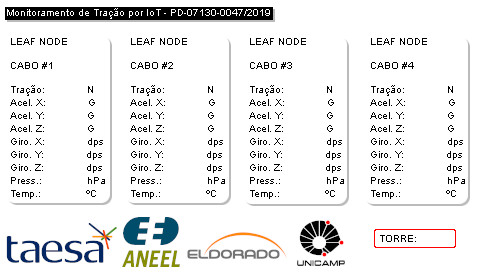
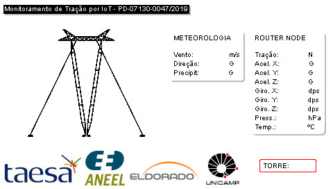

# C++ cross-compiled UI interface

At the beginning of a project for IoT power transmission lines monitoring, there was a need for UI implementation in an embedded custom Linux controller. At that time, the Linux Engineer of our team still hadn't built the environment for PyQT5 and other Python packages development.

So, my job was to fill that gap and work with what I had available: to build binaries that control the display framebuffer device. I built the following UI interfaces with a cross-compiling C++ code for armv7 architecture. The program wrote pixels directly to the device framebuffer, showing gathered IoT data on the display.

It was hard work, but I learned how to cross-compile programs and write Makefile files for compiling automation.

