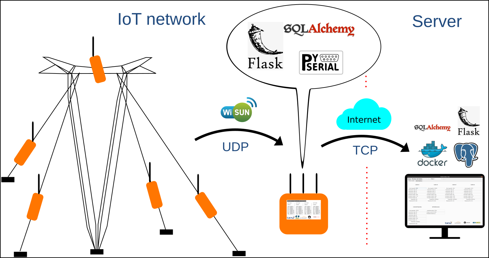

# IoT network and its architecture

### 2021

In this project, IoT devices were projected to be installed in cable-stayed power transmission lines for variable measurement and fail prediction. The IoT devices connected each other through a WiSUN-FAN mesh network and all gathered data was collected in an embedded Linux gateway. The gateway sent all data to a processing server.

I was responsible for designing the software system architecture, modeling the data structs for the Postgres and SQLite databases, configuring Docker containers and the development of all the Python scripts, including the gateway and the server side.

Technologies that I was working on: Docker, Python, Python, SQLAlchemy, Postgres, PySerial and embedded Linux sysadmin procedures.

